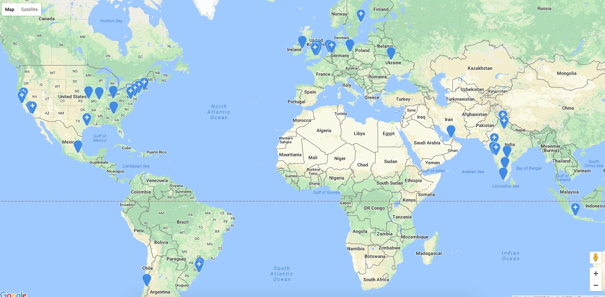

# Basic Intro

  

This is a **Slack Group** for DevOps Professionals.

Join Slack: [https://www.dennyzhang.com/slack](https://www.dennyzhang.com/slack)

**What For?**

**1. Slack Brings People Closer.**

   Make friends and have daily chat with DevOps professionals.

**2. Have Real And Deep Conversations.**

   Solve your questions and problems every day.

**3. This Slack Group Is Operated In An Open Source Way.**

   We use DevOps skills to maintain DevOps slack group.

For any suggestions, file us [Tickets](https://github.com/DennyZhang/mywechat-slack-group/issues) or [PRs](https://github.com/DennyZhang/mywechat-slack-group/pulls). Star [the GitHub repo](https://github.com/USDevOps/mywechat-slack-group).

See Active Slack Members In An World Map.

 (Live map: http://slack.romain.tech)
 

# For New Members
Welcome to the community!
- Send us (any [admin](./Admin.md)) a private message. We'd like to welcome everyone in personal.
- [Channels](./Channels.md): Find the channels you're interested, join us and start your conversations.
- [Admin](./Admin.md): All slack admins. Any active user can ping Denny(@dennyzhang) to apply the admin role.
- [Rules](./guidelines/README.md): General guidelines for everyone.

# Maintainers & Active Users
- Contact Of [Active Members](Members.md). Find your info missing? Send us a PR.
- Contact Of [Slack Admins](Admin.md)
- Help us to promote this slack group: [promotion](promotion/README.md)
- Any active slack users can apply Admin roles by default. Just ping #suggestions channel.

# Contributors: Give people credits

**GIVE PEOPLE CREDITS**, if someone has helped you a lot.
1. Endorse his/her skills in LinkedIn
2. Write a LinkedIn recommendation
3. Or simply Say Hi him/her privately

# More Information
- See our group maintenance experience: [maintain-slack-group](https://github.com/DennyZhang/maintain-slack-group)

# License
- Code is licensed under [MIT License](https://www.dennyzhang.com/wp-content/mit_license.txt).

